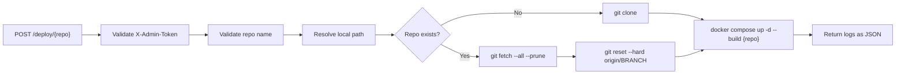

# deployer

Lightweight self-hosted deployment API for Docker Compose services backed by Git repositories over SSH.

`deployer` is a small Go service that exposes two protected REST endpoints:

- `POST /deploy/{repo}`
- `POST /rollback/{repo}`

It clones or updates a repository, then runs Docker Compose for the matching service. The service is designed for simple multi-repo setups where:

- one folder = one Git repository
- one repository = one deployable service
- one API call = one deployment or rollback operation

## Why This Exists

For many teams, deployment automation is either too heavy or too opaque. `deployer` focuses on a very specific workflow:

- Git remains the source of truth
- Docker Compose remains the runtime orchestrator
- SSH keys remain the access mechanism for private repositories
- a tiny HTTP API becomes the trigger point

This keeps the deployment path easy to understand and easy to operate.

## What It Does

### Deploy flow



### Rollback flow


## Core Behavior

### Deploy

When `POST /deploy/{repo}` is called:

1. The repo name is validated.
2. The service resolves the local repo path under `DEPLOY_BASE_PATH`.
3. If the repo does not exist locally, it is cloned from `GIT_BASE_SSH`.
4. If it already exists, it is updated with:
   - `git fetch --all --prune`
   - `git reset --hard origin/<BRANCH>`
5. The service runs:

```bash
docker compose up -d --build <repo>
```

6. The API returns execution logs in JSON.

### Rollback

When `POST /rollback/{repo}` is called:

1. The repo name is validated.
2. The service resolves the local repo path.
3. The previous commit is resolved with `HEAD~1`.
4. The repo is checked out at that commit.
5. The service runs:

```bash
docker compose up -d --build <repo>
```

6. The API returns execution logs in JSON.

Current rollback behavior checks out the previous commit in detached HEAD mode. A later deploy moves the repository back to `origin/<BRANCH>`.

## Architecture

```text
cmd/main.go
  -> load env config
  -> build logger
  -> create deployer service
  -> start HTTP server

internal/config
  -> environment-driven configuration

internal/http
  -> routing
  -> auth middleware
  -> repo validation
  -> JSON responses

internal/service
  -> command executor
  -> git service
  -> docker service
  -> deploy / rollback orchestration
```

## Security Model

### Admin token

Protected endpoints require:

```http
X-Admin-Token: <your-token>
```

The token is checked with a constant-time comparison.

### Repo name validation

Only repository names matching this pattern are accepted:

```text
[a-zA-Z0-9-_]+
```

This blocks:

- path traversal attempts such as `../app`
- slashes like `foo/bar`
- backslashes
- dots and other unexpected path characters

## API

### Health check

```http
GET /healthz
```

Response:

```json
{
  "status": "ok"
}
```

### Deploy a repo

```http
POST /deploy/my-service
X-Admin-Token: change-me
```

Success response:

```json
{
  "repo": "my-service",
  "logs": "cloning git@github.com:my-service.git into /repos/my-service\nrunning docker compose up for service my-service\ndeploy completed successfully"
}
```

Error response:

```json
{
  "repo": "my-service",
  "logs": "fetching updates in /repos/my-service",
  "error": "git fetch in \"/repos/my-service\" failed: ..."
}
```

### Roll back a repo

```http
POST /rollback/my-service
X-Admin-Token: change-me
```

Success response:

```json
{
  "repo": "my-service",
  "logs": "resolving previous commit in /repos/my-service\nchecking out previous commit 1234567\nrunning docker compose up for service my-service\nrollback completed successfully"
}
```

## Configuration

The service is configured entirely via environment variables.

| Variable | Default | Description |
|---|---|---|
| `HOST` | empty | Bind host. Empty means all interfaces. |
| `PORT` | `8080` | HTTP server port inside the container. |
| `LOG_LEVEL` | `INFO` | Go `slog` log level. |
| `DEPLOY_BASE_PATH` | `./repos` | Base directory where repositories are stored. |
| `GIT_BASE_SSH` | `git@github.com:` | SSH base used to build clone URLs. |
| `BRANCH` | `main` | Branch used for deploy sync. |
| `ADMIN_TOKEN` | empty | Required token for protected endpoints. |

### Repository URL resolution

For a repo named `my-service`:

- `GIT_BASE_SSH=git@github.com:` -> `git@github.com:my-service.git`
- `GIT_BASE_SSH=git@github.com:my-org/` -> `git@github.com:my-org/my-service.git`
- `GIT_BASE_SSH=ssh://git@my-git.example.com/repos` -> `ssh://git@my-git.example.com/repos/my-service.git`

## Running With Docker Compose

The project includes a ready-to-use [`docker-compose.yml`](/Users/jaume.bret/projects/deployer/docker-compose.yml) that mounts:

- `/var/run/docker.sock`
- `./repos`
- `${HOME}/.ssh`

Port mapping:

- host `8081` -> container `8080`

Start it with:

```bash
ADMIN_TOKEN=super-secret docker compose up -d --build
```

Then call the API:

```bash
curl -X POST \
  -H "X-Admin-Token: super-secret" \
  http://localhost:8081/deploy/my-service
```

## Running Locally Without Docker

```bash
go run ./cmd
```

Example:

```bash
ADMIN_TOKEN=super-secret \
DEPLOY_BASE_PATH=./repos \
GIT_BASE_SSH=git@github.com:my-org/ \
BRANCH=main \
PORT=8080 \
go run ./cmd
```

## Container Design

The runtime container includes:

- the compiled `deployer` binary
- `git`
- `docker-cli`
- CA certificates

The container does not run Docker Engine internally. It talks to the host Docker daemon through the mounted Unix socket.

## Project Layout

```text
.
├── cmd/
│   └── main.go
├── internal/
│   ├── config/
│   ├── http/
│   └── service/
├── Dockerfile
├── docker-compose.yml
└── README.md
```

## Limitations

- Rollback currently uses `HEAD~1`, not a persisted deployment history.
- The service assumes the Docker Compose service name matches the repo name.
- The service expects repository access through pre-mounted SSH keys.
- There is no job queue or concurrency control yet.

## Roadmap Ideas

- deployment history persistence
- rollback to arbitrary commit or release tag
- webhook support
- audit trail
- per-repository configuration
- asynchronous deployment jobs
- structured deployment status endpoint

## License

Open source project. Add your preferred license file before publishing.
